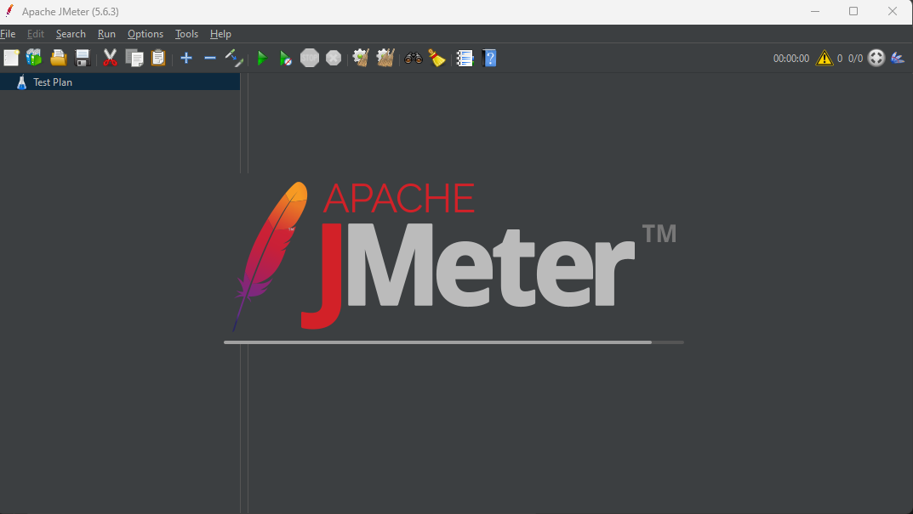

<h1 align="center">Exercício EBAC Testes de Performance</h1>

<p align="center"></p>

--------
## Configurando o Ambiente :gear

- [Apache JMeter](https://jmeter.apache.org/download_jmeter.cgi)

- [Documentação JMeter](https://jmeter.apache.org/usermanual/)

### Requisitos para instalação

- [Node.js](https://nodejs.org/en/)
- [Java 8 ou superrior](https://javadl.oracle.com/webapps/download/AutoDL?BundleId=244036_89d678f2be164786b292527658ca1605)

### Execução do Apache JMeter e Agent Server

Baixe o projeto e execute os seguintes arquivos:

```shell
Exercicios_Ebac_Performance\apache-jmeter-5.6.3\bin\jmeter.bat
----
Exercicios_Ebac_Performance\ServerAgent-2.2.3\startAgent.bat
```

### Links úteis

Caso seja necessário baixar o gerenciador de plugins (PluginsManager) pode ser encontrado no seguinte link

- [PluginsManager](https://jmeter-plugins.org/wiki/PluginsManager/)

Depois inclua na seguinte pasta
```
Exercicios_Ebac_Performance\apache-jmeter-5.6.3\lib\extjmeter-plugins-manager-1.10.jar
```

Obs.: O projeto já conta com todos os arquivos e eles estão na pasta de instaladores caso precise criar um novo projeto.
